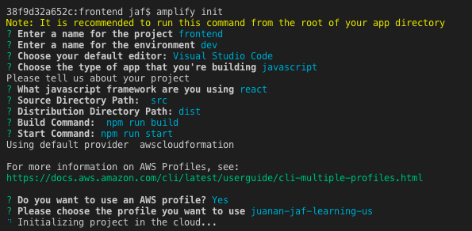
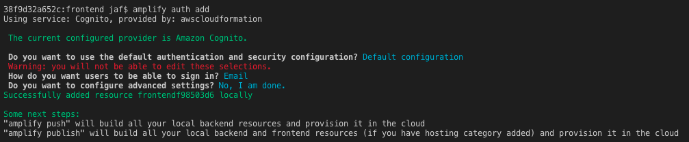
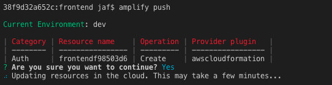
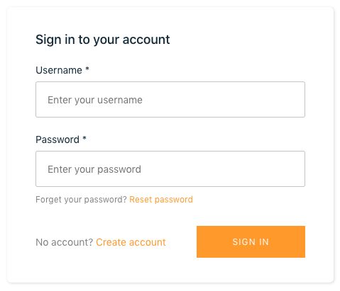

# Frontend Forecast Demo
This module of the demo application is a simple webpage that uses AWS SDK for JavaScript to interact with **Amazon S3** and **Amazon Forecast**
Additionally, it uses **AWS Amplify** and **Amazon Cognito** to only let authorized users view the forecast.

## Setup
To complete the setup process there are a few steps to complete:

1. Install all the specified **dependencies** in the file 'package.json'
```
npm install
```

2. If you haven't previously installed **Amplify CLI**, now it is the perfect time
```
npm install -g @aws-amplify/cli
```

3. Initialize **AWS Amplify**. In the screenshot you can see the choosen values but you should set your own ones)
```
amplify init
```


4. Add the required feature for **Amazon Cognito**
```
amplify auth add
```


5. Build all the local backend (in this case, only Auth feature) and **provision it in AWS**
```
amplify push
```


6. Finally, you can start the webpack server that automatically will open the url: http://localhost:8080
```
npm run start
```


